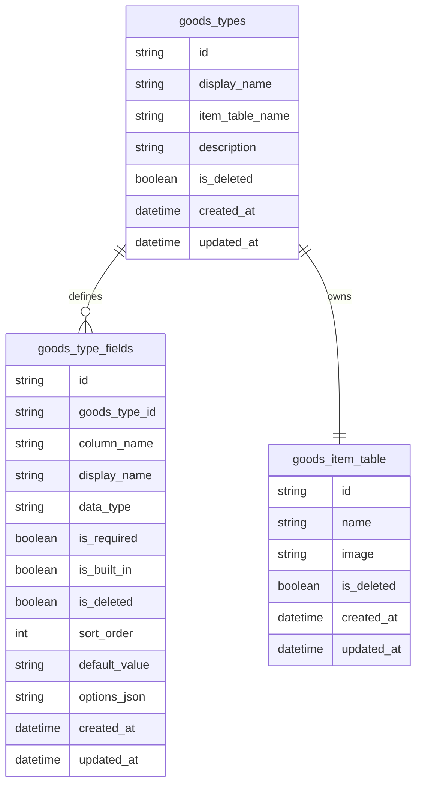
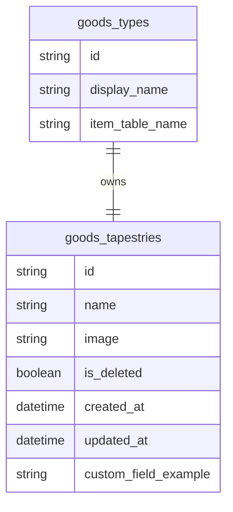
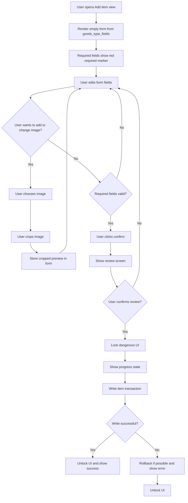
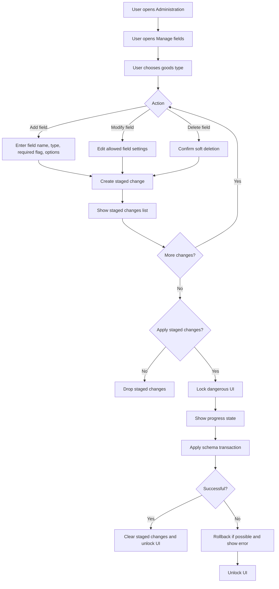
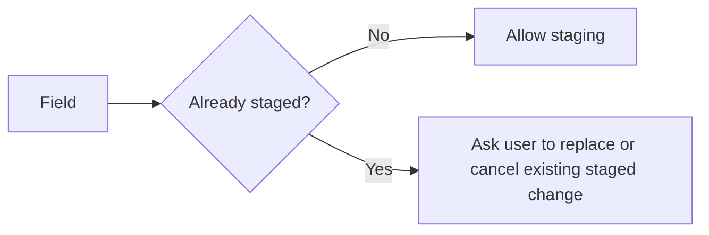
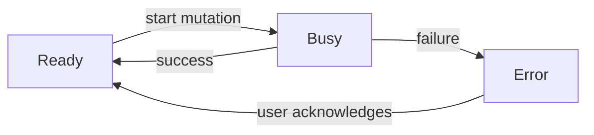

# Data Model Design

This document describes the planned database model and database-related workflows. It is a design document only; implementation should follow later.

## Goals

- Support multiple goods types.
- Let each goods type define custom item fields.
- Keep required built-in item fields stable.
- Use soft deletion for schema changes.
- Keep the first implementation local-first and simple.
- Leave room to move images out of the database later.

## Naming Rules

Use lowercase `snake_case` for physical database identifiers.

Examples:

```text
goods_types
goods_type_fields
goods_tapestries
goods_acrylic_goods
```

User-facing names can use normal text and can be renamed without changing the physical table name.

Use uppercase for SQL keywords if desired, but not for physical table or column names.

## Core Tables



## Goods Type Table

`goods_types` stores the list of goods types and maps each type to its generated item table.

```text
goods_types
- id
- display_name
- item_table_name
- description
- is_deleted
- created_at
- updated_at
```

`id` should be stable. `display_name` can change. `item_table_name` should not change after creation unless a future migration tool is explicitly built.

## Item Tables

Each goods type owns one item table. For example, a `Tapestries` goods type may own:

```text
goods_tapestries
```

Every item table must have these built-in fields:

```text
id
name
image
created_at
updated_at
is_deleted
```

Built-in fields cannot be deleted by the user.

`id` and `name` are required. `image` should exist by default but can be optional.

Example:



## Field Metadata

`goods_type_fields` describes each built-in or custom field.

This table is needed because a physical database column alone does not know:

- the user-facing display name
- the field type
- whether the field is required
- whether the field is built-in
- sort order in forms/tables
- whether the field was soft-deleted
- future select/tag options

Recommended initial field types:

```text
text
long_text
number
date
boolean
url
select
```

Future field types:

```text
tags
price
rating
image_set
relation
```

## Image Storage

For the first implementation, `image` can store a stringified low-resolution image. This matches the expected database size: at most a few thousand entries even after long-term use.

The code should still treat image storage behind a small image-service boundary so a future version can move images to:

- local files
- browser storage blobs
- object URLs
- a separate `ASSETS` table
- cloud/object storage

Todo:

- define max image dimensions
- define image compression settings
- define whether original images are kept
- add migration path from database image strings to external assets

## Soft Deletion

Items, goods types, and fields should use soft deletion.

Soft deletion means records are marked deleted instead of being physically removed:

```text
is_deleted = true
```

This matters most for field deletion. Dropping a database column immediately is risky because it destroys data. The first version should mark fields as deleted and hide them from normal forms/views.

Future work:

- restore deleted fields
- permanently purge deleted fields
- export data before purge

## Add Item Workflow



During the database write, the app should prevent competing dangerous operations:

- changing goods type schema
- adding another item to the same table
- deleting fields
- switching into operations that mutate the same data

The UI does not need to freeze every harmless view, but it should clearly show that a database mutation is in progress.

## Image Crop Requirement

When adding an item image, the user should crop the image before saving.

Allowed aspect ratios:

```text
portrait 1:sqrt(2)
horizontal sqrt(2):1
```

These match A-series and B-series paper ratios.

The stored database image should be the processed/cropped low-resolution version, not the raw original.

## Field Management Workflow

The Administration view should avoid the word "column" in user-facing UI. Better labels:

```text
Manage fields
Customize item fields
Edit fields
```

Recommended user-facing label:

```text
Manage fields
```

Field changes should be staged before they are applied.



Rules:

- A field can have only one staged change at a time.
- Built-in fields cannot be deleted.
- `id` and `name` cannot be made optional.
- Deleted fields are soft-deleted first.
- If the user leaves without applying, staged changes are dropped.

## Field Modification Advice

Field modification is more complicated than adding or deleting.

Safe first-version modifications:

- rename display name
- change required flag from required to optional
- change sort order
- edit select options only if old values remain valid

Riskier modifications:

- changing data type
- changing optional to required when existing rows have empty values
- renaming the physical column name
- removing select options that existing items use

Recommended rule for the first implementation:

```text
Allow safe metadata-only modifications first.
Defer destructive or data-migrating modifications.
```

For example, changing a field from `text` to `number` should be a future migration feature, not a simple edit.

## Staged Schema Changes

Staged schema changes should live only in local UI memory.

Do not store staged schema changes in the database. If the user closes or refreshes the app before applying changes, the staged changes should disappear. This keeps the database limited to applied truth and avoids leaving half-intended schema edits behind.

Only one staged change per field should be allowed:



## Backup Strategy

Creating a full database backup before every schema change is safe but can grow large.

Given the expected database size is only a few thousand entries after decades, full backups may be acceptable for early versions. Still, the design should avoid making full backups mandatory forever.

Recommended staged approach:

1. First version: create a full export/backup before applying schema changes.
2. Later: keep migration logs for schema changes.
3. Later: add manual backup/export tools.
4. Later: add automatic backup retention rules.

Backup retention should eventually be limited, for example:

```text
Keep last 10 automatic schema-change backups.
Let user export permanent backups manually.
```

## Database Locking / Busy State

Any database mutation should use a shared app-level busy state.



When busy:

- disable dangerous actions
- show progress
- keep current operation visible
- prevent navigation into conflicting mutation flows
- avoid starting another schema or item mutation

This should be implemented as a central service/state later, not separately inside each form.

## Open Decisions

- Exact database engine.
- Maximum stored image dimensions and compression quality.
- Whether original images are discarded or stored separately.
- Backup format and backup location.
- Whether field restoration is available in the first database version.
- Whether tags are global, per goods type, or per field.
