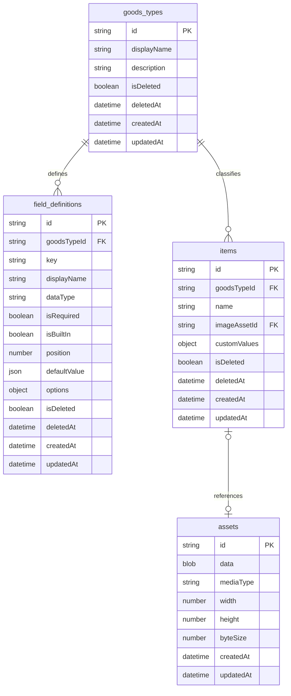

# Domain Model

This document defines the stable application records. Goods types and their
protected built-in field definitions can now be created atomically. Remaining
mutation behavior is specified in [Workflows](workflows.md).

## Goals

- Support many goods types without changing physical database schema.
- Let each goods type define custom item fields.
- Keep protected item fields consistent across goods types.
- Preserve soft-deleted records until an explicit purge.
- Keep records independent from IndexedDB and UI components.
- Remain exportable to a versioned, storage-neutral format.

## Naming

- JavaScript record properties use `camelCase`.
- Persistent object-store and index names use lowercase `snake_case`.
- IDs are opaque stable strings and never derive from editable labels.
- User-facing labels use unrestricted normal text.

## Relationships



IndexedDB does not enforce relationships. Domain operations validate references
before opening a write transaction.

## Goods Type

A goods type classifies items and owns field definitions. It does not own a
physical table or object store.

```js
{
  id: "stable-generated-id",
  displayName: "Tapestries",
  description: "Wall scrolls, fabric posters, and related display goods.",
  isDeleted: false,
  deletedAt: null,
  createdAt: "2026-07-20T00:00:00.000Z",
  updatedAt: "2026-07-20T00:00:00.000Z"
}
```

`displayName` may change. `id` must not. Creation order is sufficient for initial
navigation; explicit ordering can be added only when the UI supports reordering.

## Field Definition

Field definitions drive forms, validation, detail labels, and item-list columns.
They are records, not physical database columns.

Initial data types:

```text
text
long_text
number
date
boolean
url
select
```

`image` is an internal type used by the protected built-in image field. It is
not offered as a general custom-field type in the first field manager.

Deferred types:

```text
tags
price
rating
image_set
relation
```

`key` is a stable identifier unique within one goods type. `displayName` is
editable. `position` gives forms and details deterministic field order.

Selection fields store stable option identities:

```js
options: {
  choices: [
    { id: "stable-option-id", label: "Owned" }
  ]
}
```

Labels may be added, but option removal and identity-changing edits remain
deferred until item-value migration rules exist.

### Built-In Item Fields

| Field | Required | User editable | Deletable |
| --- | --- | --- | --- |
| `id` | Yes | No | No |
| `name` | Yes | Yes | No |
| `image` | No | Yes | No |

`createdAt`, `updatedAt`, `isDeleted`, and `deletedAt` are system properties.
Goods-type creation stores all three built-in field records so future renderers
can process built-in and custom fields through one path. The creation operation
sets their protected metadata; field-management operations reject changes that
violate these rules.

## Item And Custom Values

All goods types share the `items` store. `goodsTypeId` determines the applicable
field definitions.

```js
{
  id: "item-id",
  goodsTypeId: "goods-type-id",
  name: "Example item",
  imageAssetId: "asset-id",
  customValues: {
    "field-id-material": "polyester",
    "field-id-release-date": "2026-07-20"
  },
  isDeleted: false,
  deletedAt: null,
  createdAt: "2026-07-20T00:00:00.000Z",
  updatedAt: "2026-07-20T00:00:00.000Z"
}
```

Custom values use stable field IDs as keys. Renaming a field therefore does not
rewrite every item, and restoring a deleted field reveals its previous values.

## Image Asset

Processed images are stored as `Blob` values in asset records. Items store only
`imageAssetId`. This avoids Base64 overhead during ordinary browser use and keeps
image storage replaceable.

Required asset metadata:

- media type
- pixel width and height
- byte size
- creation and update timestamps

Item entry stores an optional processed low-resolution JPEG. Portrait output is
`560 x 792`; landscape output is `792 x 560`. Source files remain only in the
in-memory draft and are not written to IndexedDB. Items without an image store
`imageAssetId: null`.

## Soft Deletion

Goods types, field definitions, and items use:

```js
isDeleted: true
deletedAt: "2026-07-20T00:00:00.000Z"
```

The boolean supports filtering. The timestamp supports restoration, retention,
and audit UI. Deleting a goods type leaves dependent fields, items, and assets
recoverable. Permanent purge is a separate destructive operation that must
explicitly traverse dependent records.

## Invariants

- IDs and creation timestamps never change after creation.
- `updatedAt` changes with every committed mutation.
- Active items reference an existing, active goods type.
- Custom value keys reference fields belonging to the item's goods type.
- Built-in fields cannot be deleted or redefined as another type.
- Active records have `deletedAt: null`.
- Deleted records have `isDeleted: true` and a deletion timestamp.

Physical storage, versioning, and adapter rules are owned by
[Persistence](persistence.md).
