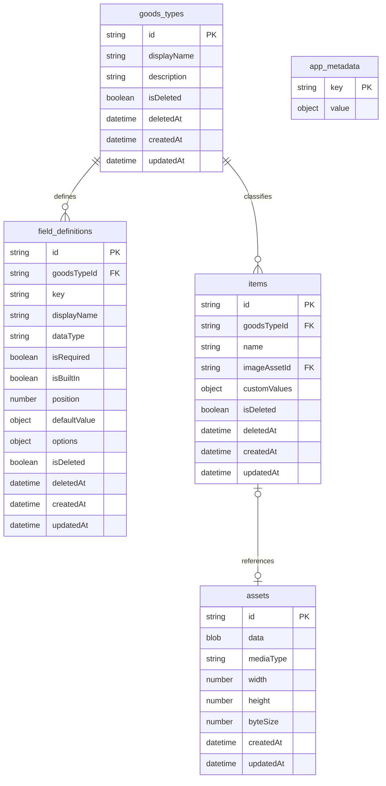
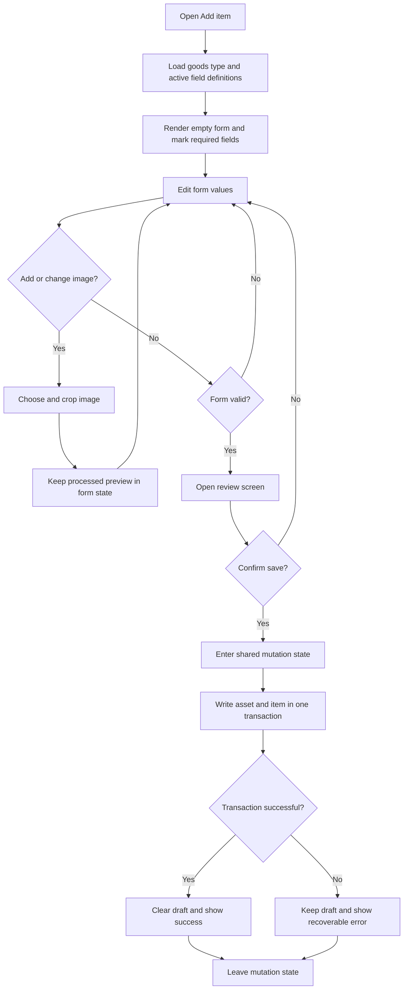
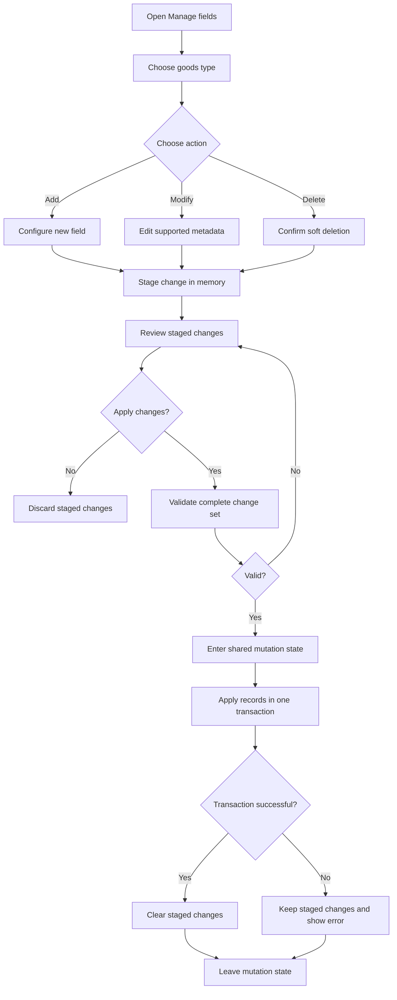
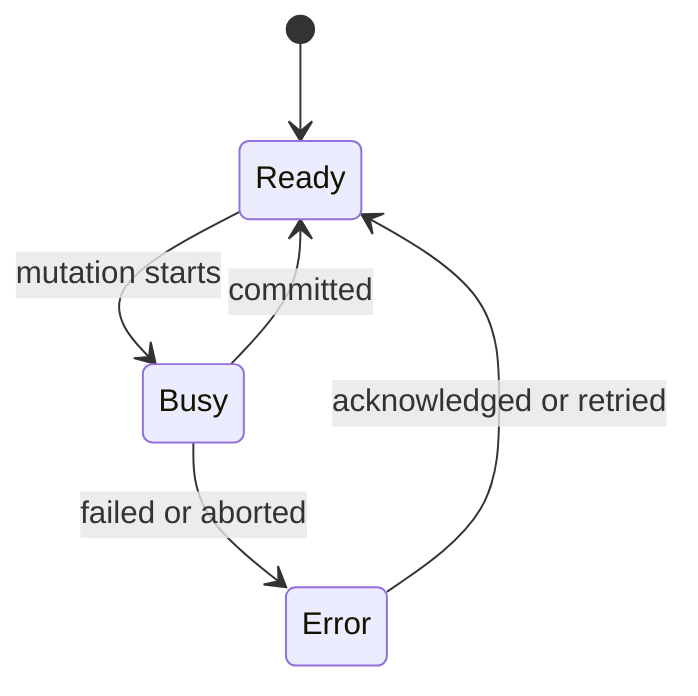

# Data Model Design

This document defines the planned browser-local persistence model and mutation
workflows. It is a design contract only; persistence is not implemented yet.

## Goals

- Run unchanged on GitHub Pages and the local development server.
- Keep each browser profile's collection local by default.
- Support multiple goods types without changing the physical database schema.
- Let each goods type define custom item fields.
- Keep required built-in item fields stable.
- Preserve deleted data until the user explicitly purges it.
- Keep debug data isolated from saved user data.
- Support versioned file export and optional cloud backup later.

## Platform Choice

User mode will use IndexedDB. It is the browser's transactional database for
structured records and binary values such as `Blob` objects.

The application will use one database:

```text
wotagoods-manager
```

Do not create one object store per goods type. Creating or removing IndexedDB
object stores requires a database-version upgrade and a blocked-upgrade flow
across open tabs. Goods types and their fields are application data, not physical
database schema.

## Naming Rules

- IndexedDB object-store and index names use lowercase `snake_case`.
- JavaScript record properties use `camelCase`.
- User-facing labels use unrestricted normal text.
- IDs are opaque stable strings and are never derived from editable labels.

This keeps persistent identifiers stable while matching JavaScript conventions
inside the application.

## Logical Model



The diagram is logical. Relationships are enforced by the storage layer because
IndexedDB does not provide foreign-key constraints.

## Physical Object Stores

The initial IndexedDB version should contain these stable object stores:

| Store | Key path | Planned indexes | Purpose |
| --- | --- | --- | --- |
| `goods_types` | `id` | `updatedAt` | Goods-type definitions |
| `field_definitions` | `id` | `goodsTypeId`, unique `[goodsTypeId, key]` | Built-in and custom field metadata |
| `items` | `id` | `goodsTypeId`, `[goodsTypeId, updatedAt]` | Items for every goods type |
| `assets` | `id` | none initially | Cropped image Blobs and metadata |
| `app_metadata` | `key` | none | Data-level metadata that is not a user setting |

Indexes are implementation details and may be revised before version 1 is
implemented. The object-store boundaries are the important contract. IndexedDB
booleans are not valid index keys, so active/deleted filtering happens after the
indexed goods-type query at this expected data scale.

## Goods Types

A goods type classifies items and owns field definitions. It does not own a
physical table or object store.

```js
{
  id: "stable-generated-id",
  displayName: "Tapestries",
  description: "Wall scrolls, fabric posters, and related display goods.",
  isDeleted: false,
  deletedAt: null,
  createdAt: "2026-07-20T00:00:00.000Z",
  updatedAt: "2026-07-20T00:00:00.000Z"
}
```

`displayName` may be renamed. `id` must never change. Navigation order can use
creation order initially; explicit user-controlled goods-type ordering can be
added later if the interface needs it.

## Field Definitions

Field definitions drive forms, validation, item-detail labels, and table columns.
They are metadata records rather than physical database columns.

Recommended initial data types:

```text
text
long_text
number
date
boolean
url
select
```

Deferred types:

```text
tags
price
rating
image_set
relation
```

`key` is a stable machine-facing identifier unique within one goods type.
`displayName` is editable. `position` is retained because forms and detail views
need deterministic field ordering; it is presentation metadata, not a SQL sort
instruction.

### Built-In Fields

Every goods type exposes these built-in item fields:

| Field | Required | User editable | Deletable |
| --- | --- | --- | --- |
| `id` | Yes | No | No |
| `name` | Yes | Yes | No |
| `image` | No | Yes | No |

`createdAt`, `updatedAt`, `isDeleted`, and `deletedAt` are system properties and
do not need normal field-definition records.

Built-in field-definition records may still be stored so one renderer can handle
built-in and custom fields consistently. Their protected rules must be enforced
by domain validation, not only by disabled UI controls.

## Items And Custom Values

All goods types share the `items` store. `goodsTypeId` determines which field
definitions apply to an item.

Custom values are stored in an object keyed by stable field-definition ID:

```js
{
  id: "item-id",
  goodsTypeId: "goods-type-id",
  name: "Example item",
  imageAssetId: "asset-id",
  customValues: {
    "field-id-material": "polyester",
    "field-id-release-date": "2026-07-20"
  },
  isDeleted: false,
  deletedAt: null,
  createdAt: "2026-07-20T00:00:00.000Z",
  updatedAt: "2026-07-20T00:00:00.000Z"
}
```

Using field IDs prevents a display-name change from rewriting every item. A
soft-deleted field leaves its values untouched, so restoring the field reveals
the existing values again.

## Image Storage

Processed images should be stored as `Blob` values in `assets`, not Base64 text
inside item records. Base64 adds size overhead and forces unnecessary encoding
and decoding in normal browser use.

An item stores only `imageAssetId`. The asset record stores:

- cropped image Blob
- media type
- pixel dimensions
- byte size
- timestamps

Allowed crop ratios are:

```text
portrait 1:sqrt(2)
horizontal sqrt(2):1
```

The first implementation should store only the processed low-resolution image.
Maximum dimensions, output format, and compression quality remain open decisions.
Keeping assets behind a storage operation allows a future implementation to use
file handles, cloud objects, or another IndexedDB strategy without changing item
renderers.

## Soft Deletion

Goods types, field definitions, and items use both:

```js
isDeleted: true
deletedAt: "2026-07-20T00:00:00.000Z"
```

The boolean supports straightforward filtering and indexing. The timestamp
supports restoration UI, auditing, retention rules, and eventual purging.

Deleting a goods type soft-deletes the type only. Its fields, items, and assets
remain recoverable. A future permanent-purge operation must explicitly traverse
and remove dependent records in one controlled process.

## Add Item Workflow



The draft and cropped preview remain UI memory until confirmation. Creating the
asset and item must use one read-write transaction so neither can be committed
without the other.

## Manage Fields Workflow

Use **Manage fields** in user-facing text. Do not expose database terms such as
"column" or "object store."



Rules:

- Staged changes live only in memory and disappear on refresh or close.
- A field can have only one staged change at a time.
- Built-in fields cannot be deleted.
- `id` and `name` cannot be made optional.
- Soft deletion preserves existing item values.
- The complete staged set is validated before opening a transaction.

Safe initial modifications:

- rename a display label
- change required to optional
- change field position
- add select options without invalidating existing values

Deferred migration operations:

- change a field's data type
- change optional to required while existing values are empty
- change a stable field key
- remove select options used by existing items

Because custom fields are metadata, applying ordinary field changes does not
require an IndexedDB version upgrade.

## Transactions And Busy State

Every mutation must be expressed as one storage-layer transaction with an
explicit store set. The central application mutation state controls conflicting
UI actions; IndexedDB transaction atomicity protects the data itself.



When busy, the app should disable conflicting mutations and show progress. It
does not need to block harmless reading or navigation unless the active workflow
cannot safely survive navigation.

## Storage Boundary

Views and navigation must not import IndexedDB APIs. They call application
operations backed by a storage adapter.

The initial contract should cover these capabilities:

```text
initialize
list/get/create/update/soft-delete goods types
list/apply field definitions
list/get/update/soft-delete items
create an item and optional image atomically
get assets needed for rendering
export/import a collection snapshot
```

Planned adapters:

- `IndexedDbStorage`: persistent user-mode implementation.
- `DebugStorage`: isolated in-memory fixtures that never write user data.

Return plain domain records from both adapters. Do not leak `IDBRequest`,
`IDBTransaction`, object-store names, or browser events into views.

## Versioning And Migrations

Three versions have different responsibilities:

1. **IndexedDB version** changes only when object stores or indexes change.
2. **Domain model version** records semantic data migrations when record shapes
   change.
3. **Export format version** allows old backup files to be imported safely.

Store domain metadata in `app_metadata`, for example:

```js
{ key: "domainModelVersion", value: 1 }
```

IndexedDB upgrades must be small, deterministic, and idempotent where possible.
Adding a goods type or custom field is normal data mutation and must never bump
the IndexedDB version.

## Export, Import, And Cloud Backup

Browser storage belongs to one origin and browser profile. Consequently:

- `http://localhost:4173` and the GitHub Pages URL have separate databases.
- clearing site data removes the local database
- another browser or device cannot see the collection automatically

Export is therefore part of data safety, not an optional convenience.

Exports must use a versioned storage-neutral representation rather than exposing
raw IndexedDB records or internal keys. A first version may use one JSON file and
encode image Blobs for portability. A later archive format can store metadata as
JSON and images as binary files without changing the domain model.

Import must validate the complete file before mutation and then either replace or
merge data in a controlled transaction. The UI must never silently merge records.

Google Drive should initially store and retrieve complete export snapshots. It
should not act as a live multi-device database until conflict handling, revision
tracking, and authentication lifecycle behavior are deliberately designed.

## Backup Strategy

Soft field deletion and metadata-only changes remove the need to make a full
backup before every ordinary field edit. Recommended progression:

1. Add explicit local export and validated import.
2. Offer a backup reminder before import, purge, or future data migrations.
3. Add optional Google Drive snapshot upload/download.
4. Add bounded automatic snapshot retention only after storage costs and conflict
   behavior are defined.

## Planned File Boundaries

The implementation should grow `src/data/` by responsibility rather than putting
all persistence in one module:

```text
src/data/
  contracts/          Storage contract and domain errors
  indexeddb/          Connection, upgrades, transactions, repositories
  debug/              In-memory debug adapter and fixtures
  models/             Record factories and validation
  transfer/           Versioned export/import mapping
```

These are planned boundaries, not directories that must be created before their
first real module exists.

## Implementation Sequence

1. Define domain record factories, validation rules, storage errors, and the
   asynchronous storage contract.
2. Move current fixtures into `DebugStorage` and preserve existing debug-mode UI
   behavior without persistence.
3. Add the IndexedDB connection, version-1 upgrade, and transaction helpers.
4. Make application startup await storage initialization and goods-type loading,
   with explicit loading and recoverable error states.
5. Add goods-type creation through application operations, then field management,
   then item creation.
6. Add versioned export and validated import before relying on the database for
   significant user data.

Each milestone should leave user mode usable and must keep debug mode isolated.
Do not add empty directories or speculative modules before their responsibility
is implemented.

## Open Decisions

- Maximum processed image dimensions, format, and compression quality.
- Whether field restoration ships in the first persistence milestone.
- Initial export format: JSON-only or an archive with binary assets.
- Import conflict choices and ID collision behavior.
- Whether explicit goods-type reordering is needed.
- Whether tags are global, per goods type, or per field.
- Google Drive authentication and snapshot retention policy.
