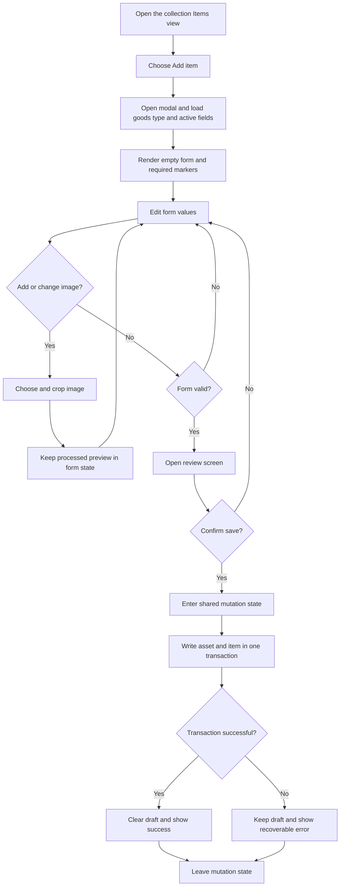
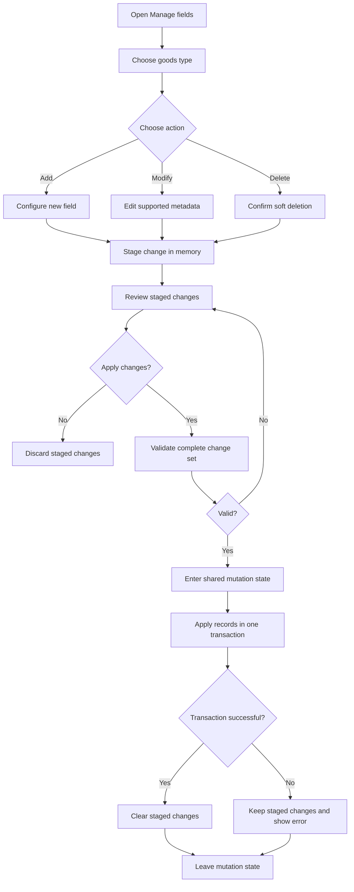
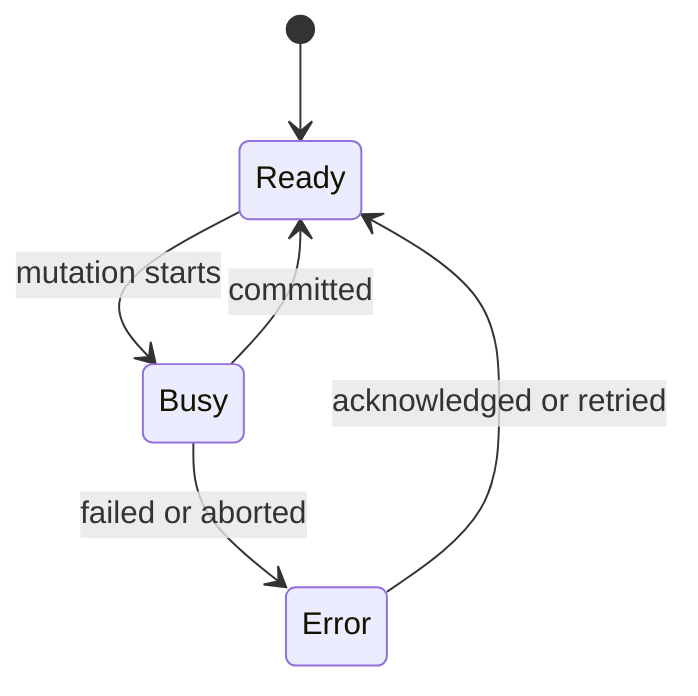

# Workflows

This document specifies implemented and planned user workflows. Their data rules
come from [Domain Model](data-model.md), and their transactions follow
[Persistence](persistence.md).

## Create Goods Type

Status: implemented.

1. User opens Administration.
2. User chooses **Add goods type**.
3. User enters a display name and optional description.
4. The form validates required text and duplicate naming guidance.
5. A review step shows the entered type details and explains that protected fields
   are created automatically.
6. Confirmation creates the goods type and built-in field definitions atomically.
7. Navigation refreshes and opens the new goods type.

Display names do not need to be globally unique, but the UI should warn when an
active type already uses the same normalized name. IDs are generated internally.
User mode persists the result in IndexedDB. Debug mode applies the same workflow
to temporary in-memory data that disappears when the page reloads.

## Add Item

Status: generated fields, image cropping, review, atomic persistence, and listing
are implemented.

The draft and cropped image stay in UI memory until confirmation. Allowed crop
ratios are portrait `1:sqrt(2)` and horizontal `sqrt(2):1`.

Scheme-less web addresses are normalized to HTTPS and explicit HTTP addresses are
rejected. Yes/no fields always store `true` or `false`; they do not have an unset
state.

## Manage Fields

Status: implemented.

Use **Manage fields** in visible UI. Do not expose terms such as column, object
store, or schema migration to ordinary users.

Rules:

- staged changes exist only in memory
- one staged change is allowed per field
- built-in fields cannot be deleted
- `id` and `name` cannot become optional
- deleting a field preserves existing item values
- the complete staged set is validated before opening a transaction

The current UI supports text, long text, number, date, yes/no, web-address, and
selection-list fields. Internal keys are generated once and are not exposed to
ordinary users. Selection options receive stable IDs. Existing options may be
extended but not removed.

Safe initial modifications:

- rename a display label
- change required to optional
- change field position
- add select options without invalidating existing values

Deferred migrations:

- change field data type
- make a field required while existing values are empty
- change a stable field key
- remove select options used by existing items

## Reset Local Data

Status: implemented.

1. User opens Administration and chooses **Reset local data**.
2. The confirmation view explains which browser-local records will be removed.
3. User types `RESET` exactly.
4. Confirmation enters the shared mutation state and clears goods types, field
   definitions, items, and image assets in one transaction.
5. Navigation remounts in the clean empty state.

The operation does not remove theme settings, cached application files, or any
backup previously exported outside the application.

## Mutation State

When busy, the application disables conflicting mutations and keeps progress
visible. Harmless reading and navigation remain available when the active flow
can survive navigation safely.
